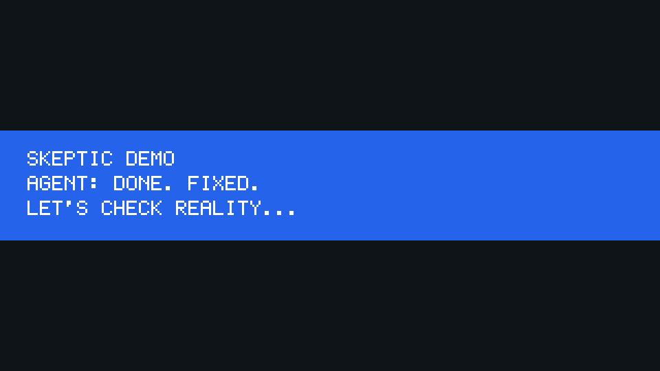

# verify-done-skills

**Agent said Done. These skills make it prove it.**

> Fake Done: fluent “Fixed” while the product is still wrong.



Coding agents love to say `Done. Fixed.`  
Unit tests may be green.  
Then you open the app — still broken.

**verify-done** is an [Agent Skill](https://agentskills.io) you install in one command. When someone claims they’re finished, the skill runs bundled checks and reports **FAIL** or **PASS** in chat — before Done is allowed.

## Install (only step you need)

```bash
npx skills add brain-marchine/verify-done-skills
```

> If the GitHub repo is not public yet: copy `skills/verify-done` into `.cursor/skills/` or `.claude/skills/` — see [docs/QUICKSTART.md](docs/QUICKSTART.md).

## Use (paste into Agent chat)

```text
Use the verify-done skill.
I fixed the inventory overflow bug on http://127.0.0.1:4173.
Please verify I'm done — run the skill scripts and report FAIL or PASS with evidence.
Do not say Done until PASS.
```

More copy-paste lines: [examples/chat-script.md](examples/chat-script.md)

## 5-minute FAIL path

Step-by-step commands (Cursor / Claude / Windows): **[docs/QUICKSTART.md](docs/QUICKSTART.md)**

1. Install skill  
2. `cd examples/demo-app && npm start`  
3. Paste the chat script  
4. See **FAIL** — not a fake Done  

## What it checks

| Check | Fails when |
|-------|------------|
| git diff | Claimed fix/done but no file changes |
| fake tests | Vacuous assertions / empty tests |
| npm test | `package.json` has `test` and it fails |
| url probe | Optional `--url` still shows broken demo markers |

## Advanced

CLI / MCP / Stop hooks → sibling project **[skeptic](https://github.com/brain-marchine/skeptic)** — see [docs/advanced.md](docs/advanced.md).

## Topics

`agent-skills` · `claude-code` · `cursor` · `skills` · `fake-done` · `verification`

**Promote / launch copy-paste pack:** [docs/PROMOTE.md](docs/PROMOTE.md)

## License

MIT
